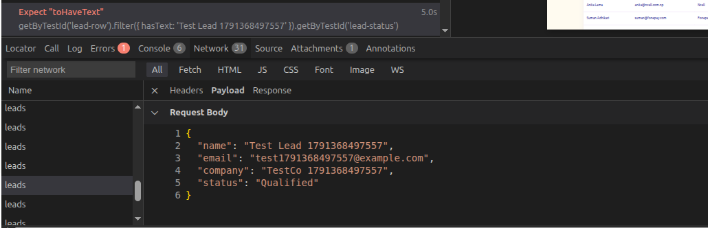
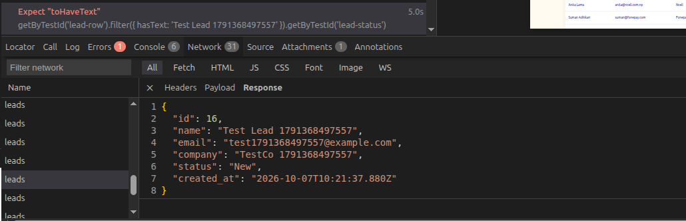
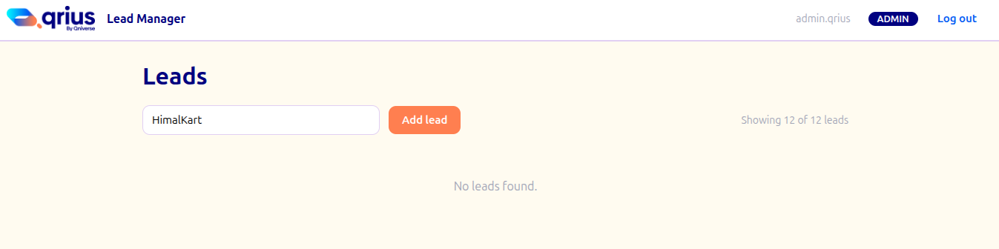
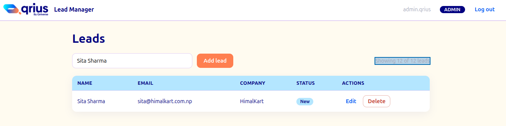

# FINDINGS

Qrius Lead Manager: Playwright automation results.

**Run date:** 2026/10/07
**Database state:** reseeded with `02_schema_and_seed.sql` (12 leads) before the run
**Command:** `npm run test:chromium` (1 worker)
**Result:** 18 passed, 5 failed (23 tests including 2 setup logins)

## Summary

| Test                                          | Result     | Verdict                    |
| --------------------------------------------- | ---------- | -------------------------- |
| Login (4 tests)                               | Passed     | n/a                        |
| Leads list: 12 leads, role badge              | Passed     | n/a                        |
| Search: by name                               | Passed     | n/a                        |
| Search: by company                            | **Failed** | App bug (confirm in trace) |
| Search: no match shows empty state            | Passed     | n/a                        |
| Search: count text reflects rows shown        | **Failed** | App bug                    |
| Add lead with status "New"                    | Passed     | n/a                        |
| Add lead with status "Contacted"              | **Failed** | App bug                    |
| Add lead with status "Qualified"              | **Failed** | App bug                    |
| Add lead with status "Lost"                   | **Failed** | App bug                    |
| Edit lead status (Contacted, Qualified, Lost) | Passed     | n/a                        |
| Delete: admin deletes a lead                  | Passed     | n/a                        |
| Delete: agent sees no delete button           | Passed     | n/a                        |

## Failures

### 1. Add lead saves the wrong status (3 tests: Contacted, Qualified, Lost)

- **Prediction (before running):** New passes because it is the default; the other three fail.
- **Actual result:** Expected `Contacted` / `Qualified` / `Lost`, received `New` in every case.
- **Trace evidence:** the POST request sends `Qualified`, but the response returns `New`.

  
  

- **Verdict:** the application has a bug.
- **Reasoning:** Creating a lead always stores `New`, while editing a lead stores the chosen status correctly (all three edit tests pass), so the fault is in the create path and not in my test.

### 2. Search by company returns nothing

- **Prediction (before running):** Search by company name should filter out the leads list.
- **Actual result:** after searching for the first row's company (`HimalKart`), no rows were found.
- **Trace evidence:**
  

- **Verdict:** the application has a bug (change to "my test is wrong" if the trace or a manual check shows rows appear).
- **Reasoning:** the company text was read from the page itself, and name search works, so search appears to ignore the company field.

### 3. Count text does not follow the search

- **Prediction (before running):** fails.
- **Actual result:** expected `Showing 1 of 12 leads`, received `Showing 12 of 12 leads` with one row visible.
- **Trace evidence:**
  

- **Verdict:** the application has a bug.
- **Reasoning:** `LeadsPage.tsx` renders `Showing {total} of {total} leads`, using the stored full count for both numbers, so it never reflects the rows on screen.

## Surprises (TDD notes)

- First full run: 7 failures, but six were "expected 12 rows, received 13". The add-lead test failed before its cleanup line, leaving a lead in the database. That was my test's fault. Fixed with `try/finally` cleanup and reseeding.
- First full run used 2 workers against one shared database. Set `workers: 1` and `fullyParallel: false`.
- The count text test never reached its real assertion on the first run because the cascade killed it in `beforeEach`. It only produced a real result after the cleanup fix.
- Login helper printed a literal `${name}` (quotes instead of backticks), and the config referenced a `setup` project that did not exist. Both were my mistakes, not app issues.
- Adding with status `New` passes even though the bug exists, because `New` is the default. Testing all four statuses exposed the pattern.

## Notes on running

- Tests share one database, so the suite runs with one worker.
- The "12 leads" assertions need a freshly seeded database; failing tests clean up after themselves with `try/finally`.
- Credentials come from `.env` (see `.env.example`).
